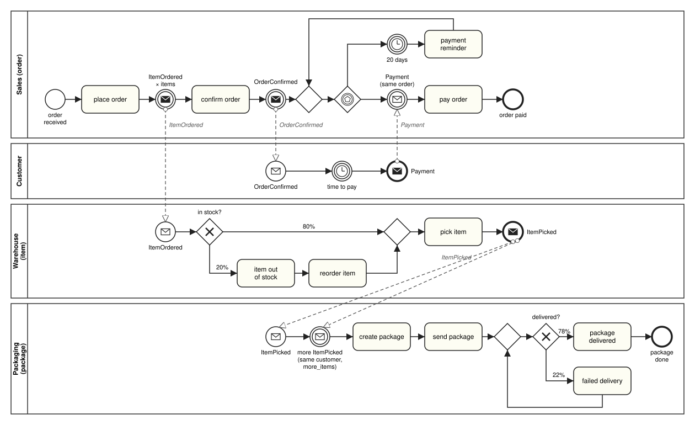
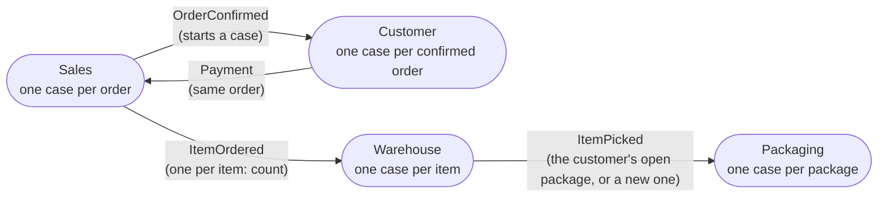

# Order Management example

A running example shaped like the OCEL 2.0 **Order Management** log (2,000 orders, 7,659 items, 1,128
packages), to show the multi-process features working together on a realistic model and to compare counts
and shares with the real log. Times are only roughly calibrated. The models are in
`testing_scripts/assets/order_management/`; the tests are in `testing_scripts/test_order_management.py`.

It uses most messaging features ([messaging.md](messaging.md)): one message per object with `count` and
`index`, processes started by messages, `copy`, conditions on case attributes, a race with a timer that
repeats, and `collect` read from a case attribute.

## The processes



```
Sales (order)        arrivals: weekdays 6:00-22:00, about one every 4.3 h, 2,000 orders
                     case attributes: customer (c1..c15), items (1..16, as in the log)
                     place order -> (throw ItemOrdered x items: case_id, index, customer)
                     -> confirm order (Sales) -> (throw OrderConfirmed: case_id)
                     -> race: catch Payment (order_id = case_id) -> pay order -> end
                            | timer 20 days -> payment reminder -> back to the race
Customer             start OrderConfirmed (copy order_id) -> timer (confirm-to-pay delay)
                     -> message end Payment{order_id}
Warehouse (item)     start ItemOrdered (copy order_id, item_index from index, customer)
                     -> XOR: 20% item out of stock -> reorder item | 80% straight on
                     -> pick item (Warehousing) -> message end ItemPicked{order_id, item_index, customer}
Packaging (package)  start ItemPicked (copy customer); case attribute more_items (0..19)
                     -> catch ItemPicked, customer = case.customer, collect more_items
                     -> create package (Warehousing) -> send package (Shipment)
                     -> XOR: 22% failed delivery -> back to the XOR | 78% package delivered -> end
```

The customer is drawn on the order and travels with the messages: order → `ItemOrdered` → item →
`ItemPicked` → package. A package starts on an `ItemPicked` that no open package takes, then collects
`more_items` more items of the same customer; waiting cases are offered messages before start events, so a
customer has at most one open package. In the log, a package takes the oldest waiting item and then all of
that customer's waiting items; that rule isn't available yet, so the package size is drawn instead. Sizes
and waiting times are therefore approximate, and a customer's last package may still be collecting when
the run ends.

Not modeled, and where each goes:

- **Links between one event and many objects** (e.g. create package with all its items, as OCEL records it):
  future work.
- **Package weight**: future work.
- **The real packing rule**, the oldest waiting item and then all of that customer's waiting items
  (`"collect": "all"` with `"same"`); it would also remove the packages still collecting at the end: future
  work.
- **Confirmation by the customer's primary sales rep** (88% of confirmations in the log; any Sales employee
  confirms here): under discussion.
- **The forwarder of a package** (the shipper sends it here): under discussion.

The Customer process only models how long a customer takes to pay; its rows aren't compared with the log.

## Who talks to whom

Every arrow goes through the orchestrator; processes never address each other. Each process is its own
consumer group, so every message goes to the one process that subscribes to its type.



## Messages

| Process       | Publishes                                                                             | Consumes                                                                                                                                                      |
|---------------|---------------------------------------------------------------------------------------|---------------------------------------------------------------------------------------------------------------------------------------------------------------|
| **Sales**     | `ItemOrdered{case_id, index, customer}`, `count` = `items`; `OrderConfirmed{case_id}` | `Payment` where `order_id == case_id`, in a race against the 20-day reminder timer                                                                            |
| **Customer**  | `Payment{order_id}`, at its message end event                                         | `OrderConfirmed` at its start event; copies `order_id` from `case_id`                                                                                         |
| **Warehouse** | `ItemPicked{order_id, item_index, customer}`, at its message end event                | `ItemOrdered` at its start event; copies `order_id` from `case_id`, `item_index` from `index`, `customer` from `customer`                                     |
| **Packaging** | nothing                                                                               | `ItemPicked` at its start event, copying `customer`; and at "more items picked" where `customer == case.customer`, collecting `more_items` (a case attribute) |

## How the log maps to the model

| In the log                     | Process   | BPMN element              | Feature                                                                                              |
|--------------------------------|-----------|---------------------------|------------------------------------------------------------------------------------------------------|
| object type **orders**         | Sales     | one case per order        | arrivals on a weekday calendar; case attributes `customer` and `items`                               |
| object type **items**          | Warehouse | one case per item         | a message start event on `ItemOrdered`, published once per item with `count`; `index` → `item_index` |
| object type **packages**       | Packaging | one case per package      | a message start event on an `ItemPicked` no open package takes; `collect` of `more_items`            |
| object type **customers**      | all       | case attribute `customer` | drawn on the order, copied to items and packages; the condition of the package's catch event         |
| object type **products**       | -         | -                         | not modeled: no metric uses them                                                                     |
| object type **employees**      | all       | resources                 | Sales (5), Warehousing (7, split 5 / 2 between Warehouse and Packaging), Shipment (6)                |
| activity **place order**       | Sales     | task `Place_Order`        | done by the `Shop` resource; `ItemOrdered` is published right after it                               |
| activity **confirm order**     | Sales     | task `Confirm_Order`      | Sales; `OrderConfirmed` is published right after it                                                  |
| activity **payment reminder**  | Sales     | task `Payment_Reminder`   | the timer branch of the race (20 days), then back to the race                                        |
| activity **pay order**         | Sales     | task `Pay_Order`          | after the message branch of the race (`Payment`); done by the `Payments` resource                    |
| activity **item out of stock** | Warehouse | task `Item_Out_Of_Stock`  | the 20% branch of an XOR                                                                             |
| activity **reorder item**      | Warehouse | task `Reorder_Item`       | after item out of stock                                                                              |
| activity **pick item**         | Warehouse | task `Pick_Item`          | Warehousing; `ItemPicked` is published at the message end event after it                             |
| activity **create package**    | Packaging | task `Create_Package`     | after the package has collected its items                                                            |
| activity **send package**      | Packaging | task `Send_Package`       | Shipment                                                                                             |
| activity **failed delivery**   | Packaging | task `Failed_Delivery`    | the 22% branch of an XOR, then back to it                                                            |
| activity **package delivered** | Packaging | task `Package_Delivered`  | the 78% branch of that XOR                                                                           |
| not in the log                 | Customer  | timer `Pay_Delay`         | how long the customer takes to pay; publishes `Payment`                                              |

## Numbers from the log

| Parameter           | Real log                                                                   | In the model                                                               |
|---------------------|----------------------------------------------------------------------------|----------------------------------------------------------------------------|
| Orders              | 2,000; one every 4.26 h on average; 95% on weekdays, mostly 6-22           | exponential gaps of 2.3 h mean within a weekday 6:00-22:00 calendar        |
| Customers           | 15, 103-152 orders each                                                    | `customer`: uniform over c1..c15                                           |
| Items per order     | 1-16 (1: 159, 2: 360, 3: 489, 4: 367, 5: 275, 6: 164, 7: 100, 8+: 86)      | `items`: these frequencies, 8+ as in the log                               |
| Out of stock        | 1,544 of 7,659 items (20%)                                                 | XOR 20 / 80                                                                |
| Confirm to pay      | median 7 days, quartiles 2.34 / 17.86, max 91; 23.5% after 20 days         | Customer timer: log-normal with that median and quartiles, at most 91 days |
| Payment reminder    | exactly 20 days after confirm or the previous reminder; 0-4 per order      | race timer, fixed 20 days                                                  |
| Items per package   | 1-20, median 6; always one customer                                        | `more_items` = size - 1, with the log's size frequencies                   |
| Failed delivery     | 311 failures in 1,439 attempts (22%); up to 7 per package                  | XOR 22 / 78                                                                |
| Employees           | Sales 5, Warehousing 7, Shipment 6; weekdays 6-22                          | the same pools on a weekday 6:00-22:00 calendar (Warehousing split 5 / 2)  |
| Gaps (with waiting) | place→confirm 18 h, place→pick 52 h, create→send 14 h, send→delivered 14 h | rough task durations; see the comparison                                   |

Place order, pay order and payment reminder have no employee in the log; here they are done by `Shop`
(always available) and `Payments` (weekdays 6-22) resources.

## Running it

```
poetry run prosimos start-orchestration --config testing_scripts/assets/order_management/simulation.json \
    --log_out_path order_management_log.csv
poetry run python testing_scripts/order_management_compare.py <path to order-management.json> order_management_log.csv
```

The full 2,000-order run takes about 25 seconds (Apple M4 Pro). The OCEL file isn't part of the repository;
the comparison script reads it from the given path.

The merged log doesn't link a package to its items, so the script reconstructs them: a customer has at most
one open package at a time, packages get consecutive case ids as they start, and each takes its first item and
then `more_items` more of that customer, in the order the items were picked. The tests check that this matches
what the engine did.

## Comparison with the log

2,000 orders, seed 1.

| Metric                                        |                       Real log |                      Simulated |
|-----------------------------------------------|-------------------------------:|-------------------------------:|
| orders                                        |                          2,000 |                          2,000 |
| items                                         |                          7,659 |                          7,744 |
| packages (still collecting at the end)        |                          1,128 |                     1,103 (14) |
| items per order: mean / median / max          |                  3.83 / 3 / 16 |                  3.87 / 4 / 13 |
| items per order: 1 / 2 / 3 / 4                |      8.0 / 18.0 / 24.4 / 18.4% |      8.4 / 16.7 / 23.3 / 19.2% |
| items per order: 5 / 6 / 7 / 8+               |        13.8 / 8.2 / 5.0 / 4.3% |        14.2 / 8.6 / 5.0 / 4.6% |
| reminders per order: mean / max               |                       0.28 / 4 |                       0.32 / 4 |
| reminders per order: 0 / 1 / 2 / 3 / 4+       | 77.8 / 17.2 / 3.9 / 0.9 / 0.1% | 80.0 / 12.4 / 4.2 / 2.4 / 0.9% |
| orders paid after 20 days                     |                          23.5% |                          20.2% |
| items out of stock                            |                          20.2% |                          19.6% |
| items per package: mean / median / max        |                  6.79 / 6 / 20 |                  6.97 / 6 / 20 |
| customers per package                         |                       always 1 |                       always 1 |
| failed deliveries per package: mean / max     |                       0.28 / 7 |                       0.27 / 6 |
| failed deliveries per package: 0 / 1 / 2 / 3+ |       81.0 / 13.2 / 4.0 / 1.8% |       79.1 / 16.3 / 3.9 / 0.7% |
| items picked before their order is confirmed  |                          25.4% |                          59.5% |
| orders paid after their first delivery        |                          67.3% |                          72.9% |

The counts and shares that come from the model's structure and parameters (items per order, out of stock,
items and customers per package, failed deliveries) match closely. The fitted confirm-to-pay distribution pays a
little earlier than the log, but has a longer tail, so more orders get 3 or 4 reminders. The largest difference
is in timing: in the log, items wait about two days before they are picked (place→pick 52 h), which the model
doesn't reproduce (about 12 h), so far more items are picked before their order is confirmed.

## Gaps found

Found while building the example; no feature was added for them.

- **`index` can't be passed on.** `index` is reserved for `count` in publish entries, so an item can't
  publish its own number under that name. The Warehouse keeps it as `item_index` instead.
- **Resources aren't shared between processes.** Picking (Warehouse) and packing (Packaging) are done by the
  same 7 Warehousing employees in the log, but each Prosimos process has its own resource pool; they are
  split 5 / 2 here. Under discussion.
- **The merged log doesn't link packages to their items** (links between events and many objects); the
  comparison script reconstructs them (see above). Future work.
- **Reminders are 20 days and one microsecond apart.** A race timer's branch continues one microsecond after
  the timer's time, so that a message at exactly that time wins ([messaging.md](messaging.md)). By design.
