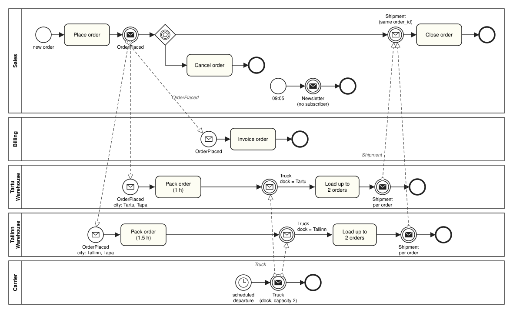
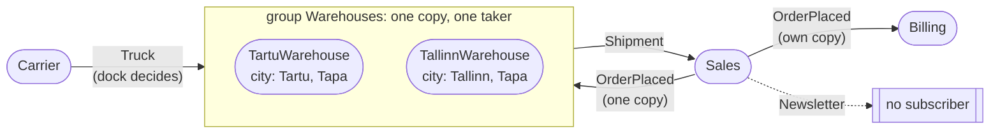
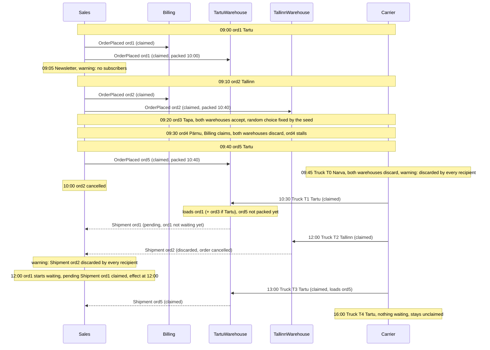

# Running example: orders, warehouses and trucks

One scenario, used throughout this documentation and in the tests, that shows how processes
exchange messages through the orchestrator ([orchestrator.md](orchestrator.md)): orders placed in
Sales are billed, packed by one of two warehouses, shipped, and closed.

It exists in three versions:

- **[Scripted version](#scripted-version)**: every process is a scripted test engine. In a single
  run it exercises every rule of the orchestrator: announcements, a shared group, a random tie,
  correlation, pending messages, discards, warnings and the end-of-run report.
- **[Real Sales version](#real-sales-version)**: Sales is a real Prosimos model that publishes and
  waits ([messaging.md](messaging.md)); the other processes are scripted.
- **[All-real version](#all-real-version)**: Sales, Billing and both warehouses are real Prosimos
  models, run from one configuration file. There are no trucks or Carrier yet: they need a case
  that waits for several messages at once.

A larger example, after a real event log and with a comparison against it, is the
[Order Management example](order-management.md).

## The scenario

### Processes and messages

| Process              | Publishes                                            | Consumes                                                                       |
|----------------------|------------------------------------------------------|--------------------------------------------------------------------------------|
| **Sales**            | `OrderPlaced{order_id, city}`, `Newsletter`          | `Shipment`, correlated on `order_id == case.order_id`                          |
| **Billing**          | nothing                                              | every `OrderPlaced`                                                            |
| **TartuWarehouse**   | `Shipment{order_id}` when an order leaves on a truck | `OrderPlaced` where `city in [Tartu, Tapa]`; `Truck` where `dock == Tartu`     |
| **TallinnWarehouse** | `Shipment{order_id}` when an order leaves on a truck | `OrderPlaced` where `city in [Tallinn, Tapa]`; `Truck` where `dock == Tallinn` |
| **Carrier**          | `Truck{dock, capacity: 2}`                           | nothing                                                                        |

```
consumer_groups:
    Sales:      [Sales]
    Billing:    [Billing]
    Carrier:    [Carrier]
    Warehouses: [TartuWarehouse, TallinnWarehouse]
```

Packing takes 1 h in Tartu and 1.5 h in Tallinn. A packed order waits for a truck. A warehouse that
claims a truck loads up to 2 waiting orders, oldest first, and publishes a `Shipment` for each.

### Process models



### Who talks to whom

Every arrow goes through the orchestrator; processes never address each other.



## Scripted version

All five processes are scripted engines (`testing_scripts/protocol_scenario.py`) with fixed orders
and trucks. Five orders arrive between 09:00 and 09:40 (ord1 Tartu, ord2 Tallinn, ord3 Tapa, ord4
Pärnu, ord5 Tartu), Sales sends one Newsletter, ord2 is cancelled at 10:00, and trucks arrive at
09:45 (Narva), 10:30, 13:00 and 16:00 (Tartu) and 12:00 (Tallinn).

### Timeline



### What this run demonstrates

| Rule         | What happens                                                                                                                                                       |
|--------------|--------------------------------------------------------------------------------------------------------------------------------------------------------------------|
| Announcement | Billing claims all five `OrderPlaced`; the Warehouses group gets one copy of each                                                                                  |
| Shared group | every order is claimed by at most one warehouse; ord1 and ord5 go to Tartu, ord2 to Tallinn                                                                        |
| Random tie   | ord3 goes to the same warehouse on every run with the same seed                                                                                                    |
| Pending      | `Shipment ord1` is published at 10:30 and takes effect at 12:00                                                                                                    |
| Discard      | ord4 and the Narva truck (T0) are discarded by both warehouses; `Shipment ord2` is discarded by Sales (case finished)                                              |
| Warnings     | exactly three: `Newsletter` (no subscribers), the Narva truck and `Shipment ord2` (each discarded by every recipient); ord4 raises none because Billing claimed it |
| Capacity     | no truck carries more than 2 orders; ord5 misses T1 and leaves on T3                                                                                               |
| End of run   | unclaimed: Truck T4 and `Shipment ord3`; discarded counts match what the engines discarded; ord4 still waiting in Sales                                            |
| Time         | step times never go backwards; the same seed gives the same run                                                                                                    |

`Shipment ord2` is a valid outcome, the order was cancelled after the warehouse packed it, but it is
still a negative one, so the orchestrator warns about it like any other message nobody could use.

Details that depend on ord3's warehouse (which truck carries it, when its shipment is published)
change with the seed. `testing_scripts/test_protocol_scenario.py` checks the rules that always hold
for any seed, plus the exact outcome of one fixed seed.

## Real Sales version

Sales is a real Prosimos model; Billing and the two warehouses are scripted engines, given to
`run_orchestrator` as extra engines (`testing_scripts/real_sales_scenario.py`, checked by
`testing_scripts/test_real_sales.py`).

```
Sales (real Prosimos, testing_scripts/assets/running_example/):
  start -> Place order -> throw OrderPlaced{case_id, city}
        -> catch Shipment (order_id == case_id) -> Close order -> end

Billing:                claims every OrderPlaced
TartuWarehouse:         claims OrderPlaced for Tartu and Tapa,   ships 1 h after claiming
TallinnWarehouse:       claims OrderPlaced for Tallinn and Tapa, ships 1.5 h after claiming
                        (Shipment{order_id}, where order_id is the order's case_id, e.g. Sales-3)
```

`city` is a case attribute drawn by Prosimos: Tartu 40%, Tallinn 30%, Tapa 20%, Pärnu 10%. Orders
arrive about every 30 minutes; consumer groups are as above (the warehouses share one group).

Compared with the scripted version, this one is simpler: no Carrier and no trucks (a warehouse
ships a fixed time after claiming), no Newsletter, and no canceled order.

What it shows, for seed 1 and 20 orders (8 Tartu, 2 Tallinn, 7 Tapa, 3 Pärnu):

| Check          | Result                                                                                                                                                   |
|----------------|----------------------------------------------------------------------------------------------------------------------------------------------------------|
| Shipped orders | every Tartu, Tallinn and Tapa order is closed after its shipment's time, shipped by a warehouse that serves its city; Tapa orders go to either warehouse |
| Pärnu orders   | Billing claims them, both warehouses discard them, so they wait forever: `finish()` reports them as the run's only stalled cases                         |
| Repeatability  | the same seed gives the same report and the same merged log                                                                                              |

The merged log holds only Sales rows, since the fake engines keep no log. Each order's
"Shipment received" wait shows in the log as the gap between Place order and Close order.

## All-real version

All four processes are real Prosimos models in `testing_scripts/assets/running_example/`, run from
one configuration file, `simulation.json` (checked by `testing_scripts/test_real_running_example.py`):

```
Sales:             start -> Place order -> throw OrderPlaced{case_id, city}
                   -> catch Shipment (order_id = case_id) -> Close order -> end
Billing:           message start OrderPlaced (any) -> Create invoice -> end
TartuWarehouse:    message start OrderPlaced (city Tartu or Tapa), copy order_id <- case_id
                   -> Pack order (1 h) -> message end Shipment{order_id}
TallinnWarehouse:  the same for Tallinn or Tapa, Pack order 1.5 h

consumer_groups:   Sales: [Sales]   Billing: [Billing]   Warehouses: [TartuWarehouse, TallinnWarehouse]
```

Only Sales has an arrival schedule (`total_cases: 20`); the other three are started by `OrderPlaced`
messages, so they have no `total_cases` and no arrival settings. Billing and the warehouses copy the
order's `case_id` into `order_id`, so the merged log shows which order each of their cases belongs
to. The whole example runs from the file:

```python
from prosimos.orchestrator import SimulationConfig, run_orchestrator

config = SimulationConfig.from_json("testing_scripts/assets/running_example/simulation.json")
report = run_orchestrator(config, log_out_path="merged_log.csv")
```

For seed 1 and 20 orders (8 Tartu, 2 Tallinn, 7 Tapa, 3 Pärnu):

| Process          | Cases                                                                                                         |
|------------------|---------------------------------------------------------------------------------------------------------------|
| Sales            | 20 orders; 17 closed, each after its shipment; the 3 Pärnu orders wait forever and are the only stalled cases |
| Billing          | 20 invoices, one per order, Pärnu included                                                                    |
| TartuWarehouse   | 12 cases: the 8 Tartu orders and 4 of the Tapa orders                                                         |
| TallinnWarehouse | 5 cases: the 2 Tallinn orders and the other 3 Tapa orders                                                     |

Every order from Tartu, Tallinn or Tapa has exactly one warehouse case, in a warehouse that serves its
city; which warehouse takes a Tapa order is a random choice of the orchestrator. There are no warnings
and no unclaimed messages, and the same seed gives the same run.
